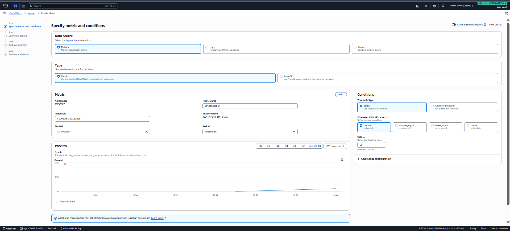
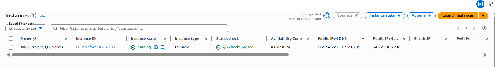
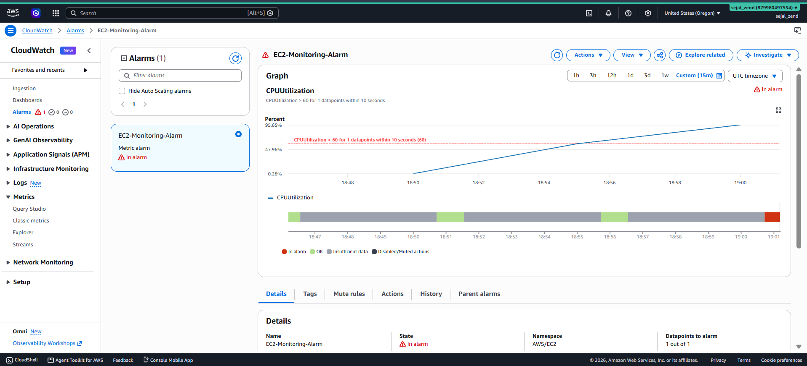
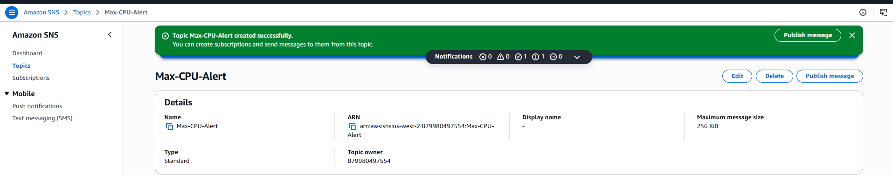
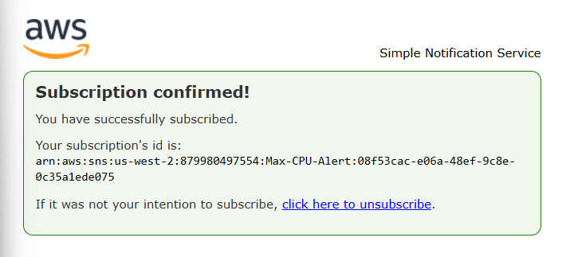
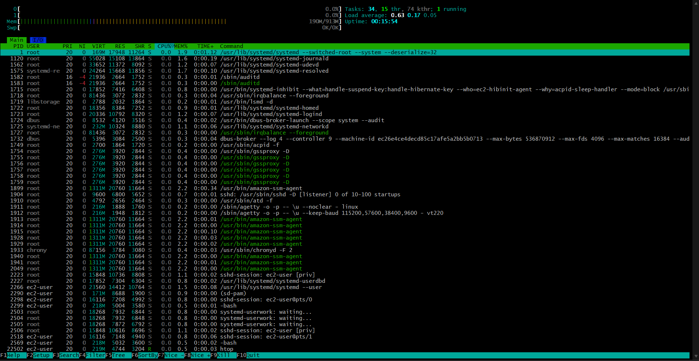
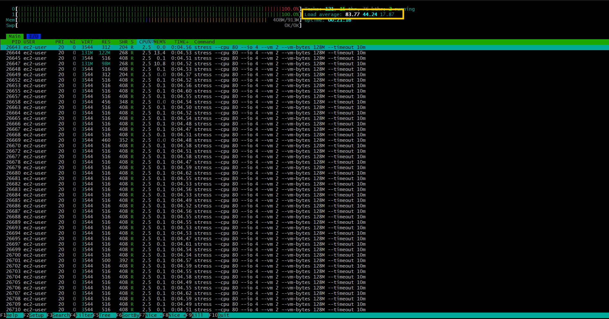
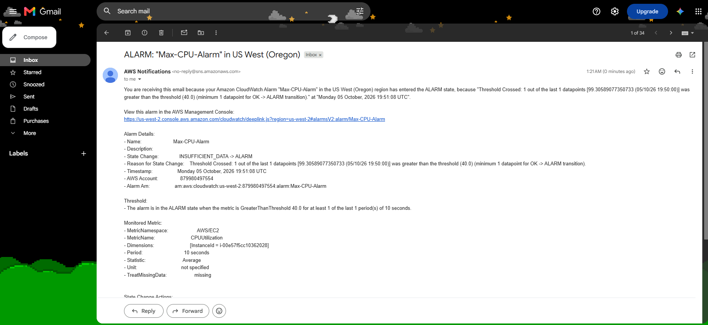

# Project 1 - EC2 Monitoring, CloudWatch Alarm & SNS Notification

## 1. Project Overview

This project implements monitoring and alerting for an Amazon EC2 instance using **Amazon CloudWatch** and **Amazon SNS**.

The objective is to:

- Launch and configure an EC2 instance.
- Monitor EC2 CPU utilization.
- Create a CloudWatch alarm for high CPU utilization.
- Configure Amazon SNS to send an email notification when the alarm is triggered.
- Test the complete monitoring and notification workflow.

### AWS Services Used

| AWS Service | Purpose |
|---|---|
| **Amazon EC2** | Hosts the virtual machine being monitored |
| **Amazon CloudWatch** | Collects EC2 metrics, provides visualization, and evaluates alarm conditions |
| **Amazon SNS** | Sends an email notification when the CloudWatch alarm is triggered |
---

# 2. Architecture

## High-Level Architecture

```text
                         AWS Cloud
                            |
                            v
                   +------------------+
                   |   EC2 Instance   |
                   |                  |
                   | CPU Utilization  |
                   | Instance Health  |
                   +--------+---------+
                            |
                            | EC2 Metrics
                            v
                  +---------------------+
                  |    Amazon CloudWatch |
                  |                     |
                  |  - Metrics          |
                  |  - Dashboard        |
                  |  - Alarm            |
                  +----------+----------+
                             |
                             | CPU > Threshold
                             | Alarm State = ALARM
                             v
                     +---------------+
                     |   Amazon SNS   |
                     |   Topic       |
                     +-------+-------+
                             |
                             | Email Notification
                             v
                       +-----------+
                       |   Email   |
                       |  Inbox    |
                       +-----------+
```


---

# 3. EC2 Instance Configuration

The EC2 instance was created through the AWS Management Console.

### Configuration

| Configuration | Value |
|---|---|
| Operating System | `Amazon Linux` |
| Instance State | `Running` |
| Instance Health | `Status checks passed` |
| Monitoring | `Amazon CloudWatch` |
| Purpose | `CloudWatch monitoring and alarm testing` |

---

# 4. CloudWatch Monitoring Configuration

The EC2 metrics were accessed from:

**AWS Console → CloudWatch → Metrics → All Metrics → EC2 → Per-Instance Metrics**

### Metric Configuration

| Setting | Value |
|---|---|
| Namespace | `AWS/EC2` |
| Metric | `CPUUtilization` |
| Statistic | `Average` |
| Period | `10 seconds` |
| Threshold | `60%` |
| Alarm Condition | `CPU utilization >= 60%` |



---

# 5. EC2 Instance Health Monitoring

The EC2 status check metrics were also monitored. The instance successfully passed the available status checks.



---

# 6. CloudWatch Alarm Configuration

## 6.1 Create the Alarm

The CloudWatch alarm was created using the EC2 `CPUUtilization` metric.

Navigation:

**CloudWatch → Alarms → Create Alarm → Select Metric → EC2 → Per-Instance Metrics**

The relevant EC2 instance was selected and the `CPUUtilization` metric was configured.

---

## 6.2 Alarm Configuration

| Setting | Value |
|---|---|
| Alarm Name | `EC2-Monitoring-Alarm` |
| Metric | `CPUUtilization` |
| Statistic | `Average` |
| Period | `10 seconds` |
| Threshold | `60%` |
| Condition | `CPU utilization >= 60%` |
| Alarm Action | `Send notification through SNS` |
| SNS Topic | `Max-CPU-Alert` |


### Alarm Logic

The alarm is designed to work as follows:

```text
IF average CPU utilization > 60%
            |
            v
     CloudWatch Alarm
            |
            v
       ALARM state
```

When CPU utilization falls back below the configured condition, the alarm can return to the **OK** state.



---

# 7. Amazon SNS Configuration

## 7.1 Create SNS Topic

An Amazon SNS topic was created for the CloudWatch alarm notification.

### SNS Topic

```text
Max-CPU-Alert
```

Purpose:

> Receive notifications from the CloudWatch high-CPU alarm and deliver them to the configured email subscriber.



---

## 7.2 Create Email Subscription

An email subscription was configured for the SNS topic.

### Configuration

| Setting | Value |
|---|---|
| Protocol | `Email` |
| Endpoint | `sejalsanzend@gmail.com` |
| Topic | `Max-CPU-Alert` |

After creating the subscription, AWS sent a confirmation email to the configured email address.

The subscription was confirmed using the confirmation link in the email.



---

# 8. Connect CloudWatch Alarm to SNS

The CloudWatch alarm was configured to publish a notification to the SNS topic when the alarm enters the **ALARM** state.

The event flow is:

```text
EC2 CPU utilization
        |
        v
CloudWatch Metric
        |
        v
CloudWatch Alarm
        |
        | CPU exceeds threshold
        v
   ALARM state
        |
        v
SNS Topic
        |
        v
Email Subscriber
```

---

# 9. Testing

Testing was performed to verify that the monitoring and alerting configuration worked as expected.

## 9.1 Normal State

Initially, the EC2 instance was operating normally.



Expected state:

```text
CPUUtilization = Normal
StatusCheckFailed = 0
CloudWatch Alarm = OK
```
---

# 10. High CPU Test

To test the alarm, CPU utilization was temporarily increased on the EC2 instance.

The purpose of this test was to make CPU utilization exceed the configured CloudWatch alarm threshold.

### Expected Event Flow

```text
CPU Load Increased
        |
        v
CPUUtilization > Threshold
        |
        v
CloudWatch evaluates metric
        |
        v
Alarm changes to ALARM
        |
        v
SNS notification published
        |
        v
Email received
```


---

# 12. SNS Email Notification Test

After the CloudWatch alarm entered the ALARM state, the configured SNS topic sent an email notification to the subscribed email address.

This confirmed the complete alerting workflow.



---

# 13. Final End-to-End Flow

The complete project workflow is:

```text
                    +----------------+
                    |  EC2 Instance  |
                    +-------+--------+
                            |
                            | Metrics
                            |
                +-----------+-----------+
                |                       |
                v                       v
        CPUUtilization          StatusCheckFailed
                |                       |
                +-----------+-----------+
                            |
                            v
                    +---------------+
                    |  CloudWatch   |
                    |    Metrics    |
                    +-------+-------+
                            |
                +-----------+-----------+
                |                       |
                v                       v
          Monitoring               CPU Alarm
          Dashboard                    |
                                       |
                              CPU > Threshold
                                       |
                                       v
                                +-------------+
                                |     SNS     |
                                |    Topic    |
                                +------+------+
                                       |
                                       v
                                  Email Alert
```

---

---

# 14. Conclusion

This project demonstrates an AWS-based monitoring and alerting solution for an EC2 instance.

Amazon CloudWatch was used to collect and visualize EC2 monitoring metrics, including CPU utilization and instance status checks. A CloudWatch alarm was configured to detect high CPU utilization. Amazon SNS was integrated with the alarm to send an email notification when the configured CPU threshold was exceeded.

The complete workflow was tested by generating increased CPU utilization, verifying that the CloudWatch alarm entered the ALARM state, confirming that an SNS email notification was received, and verifying that the alarm returned to the OK state after CPU utilization returned to normal.

This demonstrates a basic AWS monitoring and alerting workflow that can be extended to other EC2 metrics and operational events.

---


